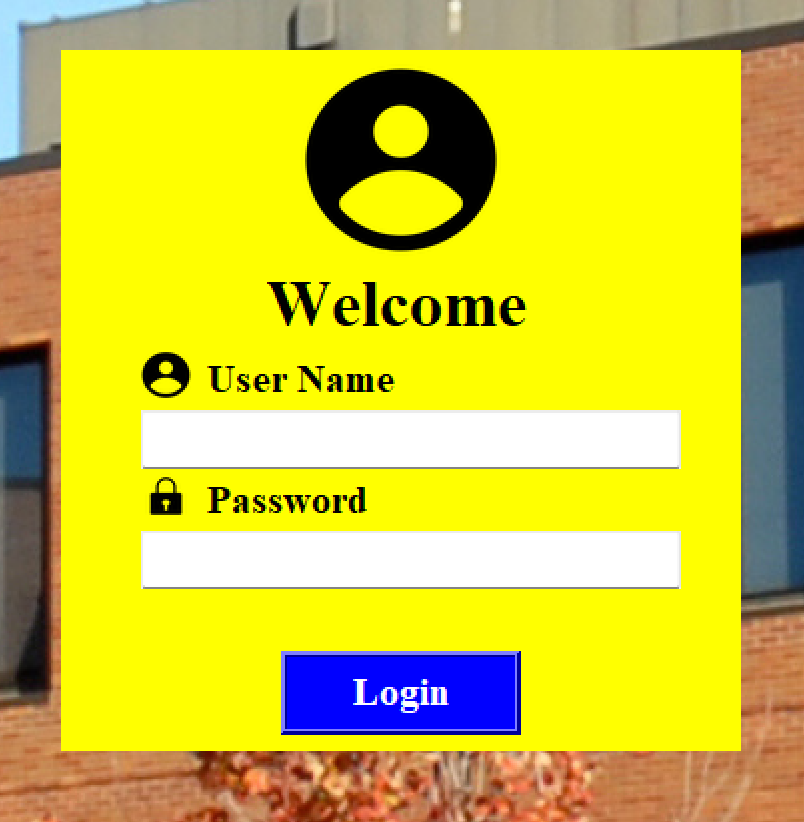
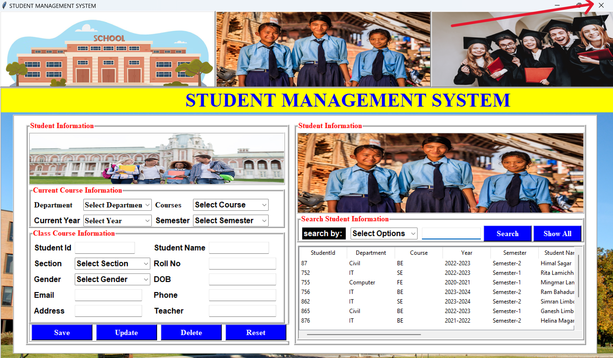

# Student Management System

## Overview

The Student Management System is a desktop application developed using Python's Tkinter library. It is designed to efficiently manage student records, allowing administrators to add, update, delete, and search for students. The system ensures that only users with the 'admin' role can access the system, providing a secure environment for managing sensitive student data.

## Features

- **Admin Login**: Only users with the role of 'admin' (role:1) can log in.
- **Add Student**: Add new student records by filling in the mandatory fields.
- **Update Student**: Update existing student records by selecting a record from the table and modifying the details.
- **Delete Student**: Delete student records by selecting the record from the table and clicking the 'Delete' button.
- **Reset Form**: Clear all fields in the form to input new data.
- **View Students**: Display all student data in a table for easy viewing.
- **Search Students**: Search for student records using various attributes such as ID, roll number, name, email, section, and semester.
- **Customize Interface Images**: Change the interface images by clicking on the current image, opening the images directory, and selecting a new image.
- **Logout/Exit**: Close the application window to log out of the system.

## Installation

To run the Student Management System, ensure you have Python installed on your system. Follow the steps below to set up the project:

1. **Clone the Repository**:
    ```bash
    git clone https://github.com/suwasg/student_ms.git
    cd student-management-system
    ```

2. **Install Dependencies**:
    Install the required Python libraries using pip:
    ```bash
    pip install python-dotenv
    pip install mysql-connector-python
    
    ```

## Usage

1. **Run the Application**:
    ```bash
    python login.py
    ```

2. **Login**:
    - Enter the admin credentials to access the system.
    - Click on the 'Login' button.

3. **Main Interface**:
    - Use the provided form to add, update, delete, or reset student records.
    - View all student data in the table on the right side of the interface.

4. **Search Functionality**:
    - Enter search parameters in the search field and click 'Search'.
    - The search results will be displayed in the table.

5. **Customize Interface Images**:
    - Click on the current image displayed in the interface.
    - This will open the images directory on your local machine.
    - Select the new image to update the interface.

6. **Logout/Exit**:
    - Close the application window to log off the system.

## Screenshots

### Login Page


### Main Interface


## License

This project is licensed under the MIT License. See the [LICENSE](LICENSE) file for details.

## Acknowledgements

- Developed by Suwas Ghale.
- Special thanks to my instructors and peers for their support and guidance.

